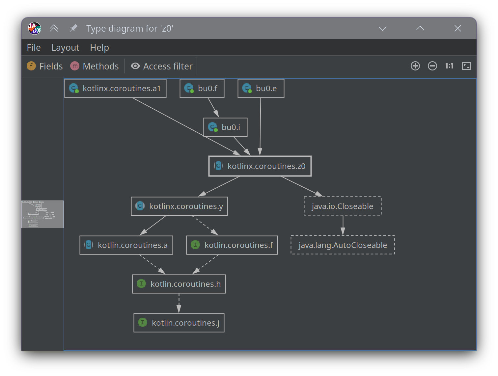
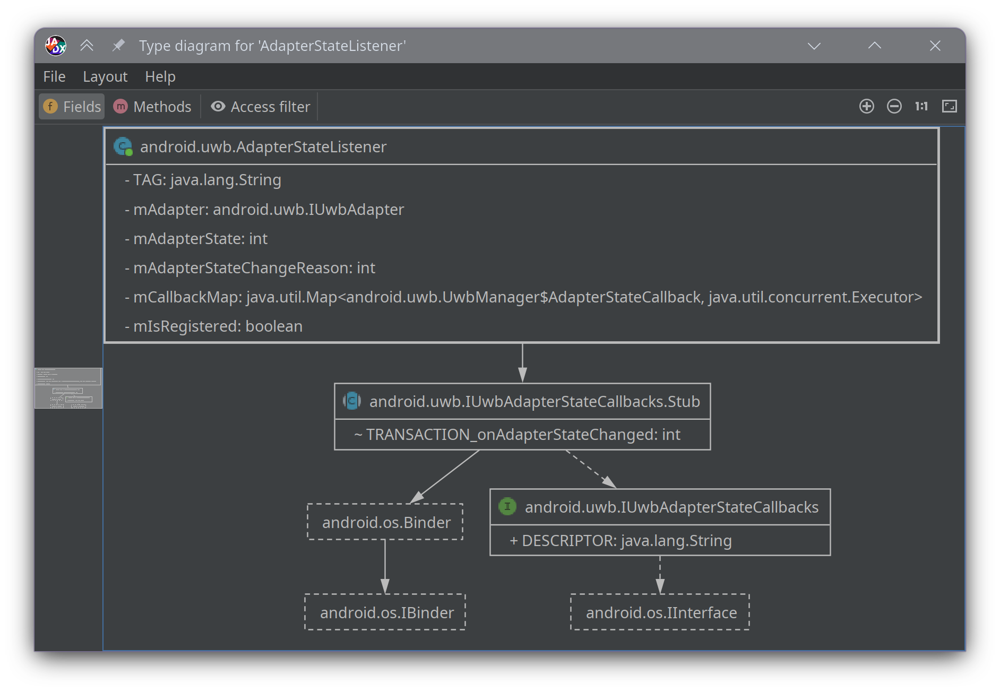

## Type diagram plugin for JADX

This plugin adds a new context menu item to the JADX code viewer, which can launch a new window that displays a type diagram for the current class.
It generates interactive UML-like class/type diagrams directly inside JADX.




### Installation

Install using location id: `github:timschneeb:jadx-type-diagram-plugin`

In jadx-cli:
```bash
  jadx plugins --install "github:timschneeb:jadx-type-diagram-plugin"
```
